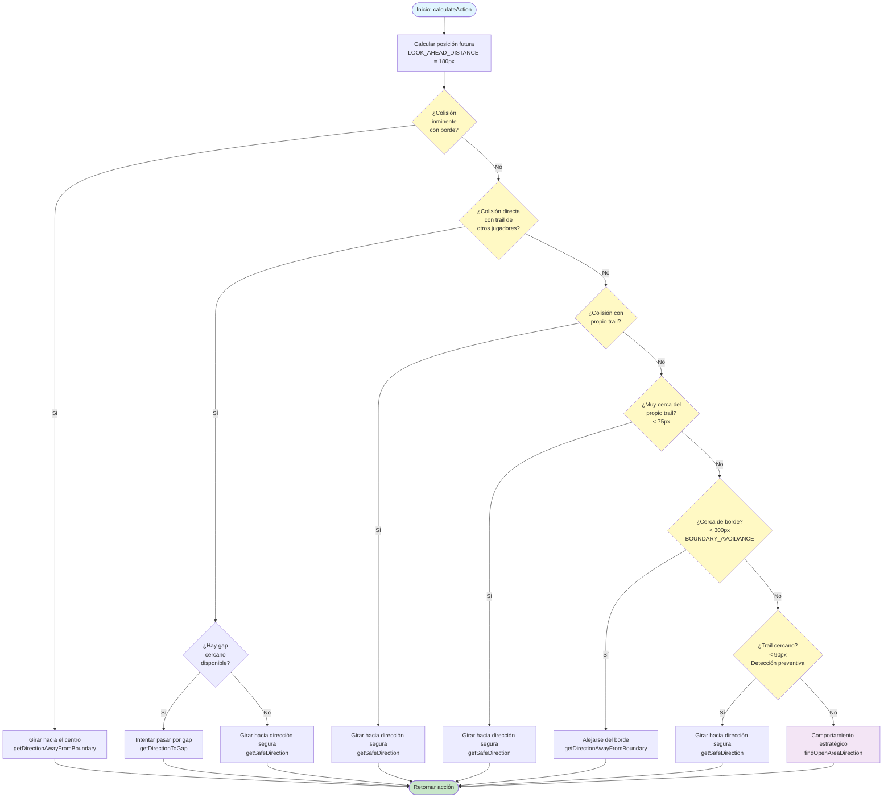
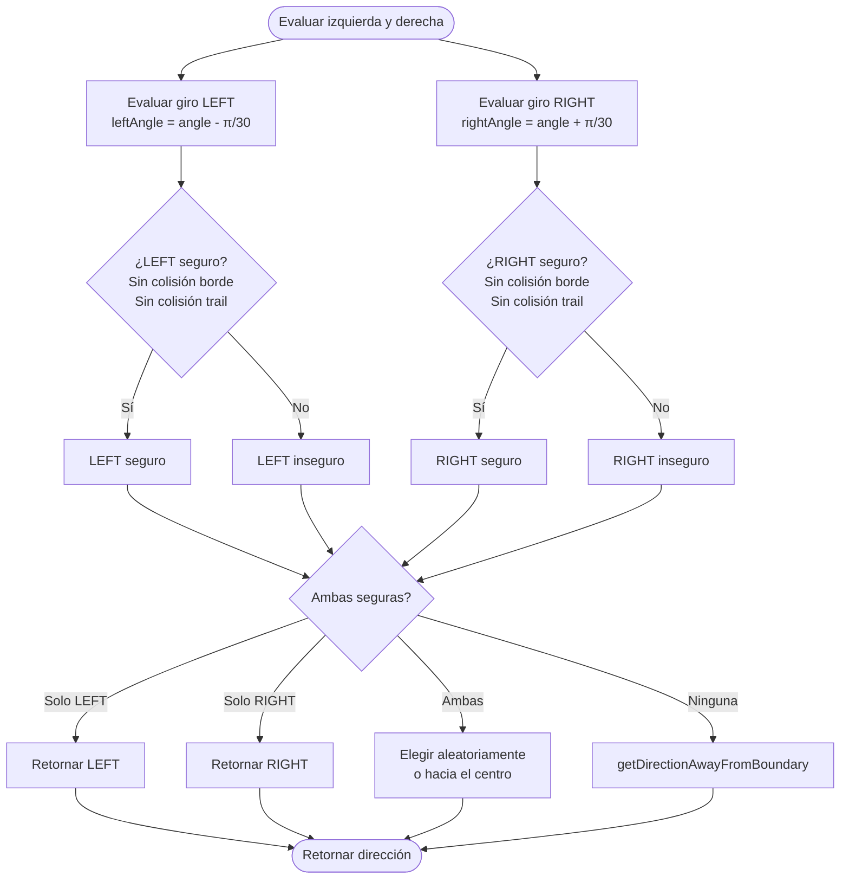
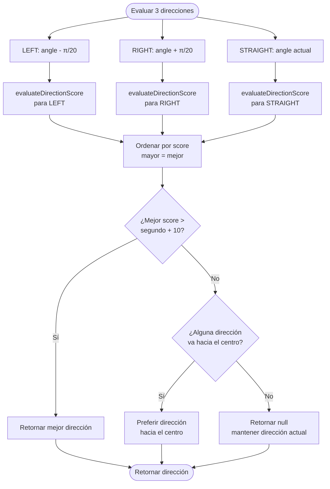
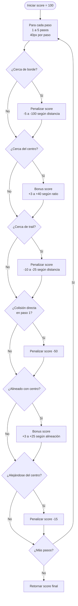

# Diagrama de Funcionamiento de la IA de Bots

## Flujo Principal de Decisión (`calculateAction`)



## Funciones Auxiliares

### 1. `getDirectionAwayFromBoundary`
```mermaid
flowchart LR
    Start([Calcular ángulo hacia centro]) --> CalcAngle[Calcular diferencia<br/>angleToCenter - bot.angle]
    CalcAngle --> Normalize[Normalizar a [-π, π]]
    Normalize --> Decision{angleDiff > 0?}
    Decision -->|Sí| Right[Girar RIGHT]
    Decision -->|No| Left[Girar LEFT]
    Right --> End([Retornar dirección])
    Left --> End
```

### 2. `getSafeDirection`


### 3. `findOpenAreaDirection`


### 4. `evaluateDirectionScore`


## Prioridades de Decisión

La IA sigue un orden de prioridad estricto:

1. **Máxima Prioridad**: Colisión inminente con borde
2. **Alta Prioridad**: Colisión directa con trail de otros
3. **Alta Prioridad**: Colisión con propio trail
4. **Media Prioridad**: Proximidad al propio trail (< 75px)
5. **Media Prioridad**: Cerca de bordes (< 300px) - **Tiene prioridad sobre trails cercanos**
6. **Baja Prioridad**: Proximidad a trails de otros (< 90px)
7. **Baja Prioridad**: Comportamiento estratégico (moverse hacia áreas abiertas)

## Parámetros Clave

- **LOOK_AHEAD_DISTANCE**: 180px (aumentado 50% para velocidad mayor)
- **BOUNDARY_AVOIDANCE_DISTANCE**: 300px (aumentado 50%)
- **Detección preventiva de trails**: 90px (aumentado 50%)
- **Detección propio trail**: 75px (aumentado 50%)
- **MAX_GAP_DISTANCE**: 180px (aumentado 50%)
- **MIN_GAP_SIZE**: 60px

## Sistema de Scoring

El sistema de scoring en `evaluateDirectionScore` evalúa:
- **Penalizaciones por bordes**: Graduales según distancia (50px = -100, 400px = -5)
- **Bonos por centro**: Graduales según ratio (0.8+ = +40, 0.1+ = +3)
- **Penalizaciones por trails**: 60px = -25, 120px = -10
- **Bonos por lejanía de trails**: >150px = +5
- **Penalizaciones por colisiones**: -50
- **Bonos por alineación con centro**: Graduales según ángulo
- **Penalizaciones por alejarse del centro**: -15

## Notas Importantes

1. **Los bordes tienen prioridad sobre trails cercanos**: Esto evita que los bots se queden atrapados en esquinas
2. **Siempre se envía input**: Incluso si no hay acción, se envía input para mantener movimiento continuo
3. **Búsqueda de gaps**: Los bots intentan pasar por gaps en trails cuando es posible
4. **Comportamiento estratégico**: Cuando no hay amenazas inmediatas, los bots se mueven hacia áreas abiertas y el centro del mapa

